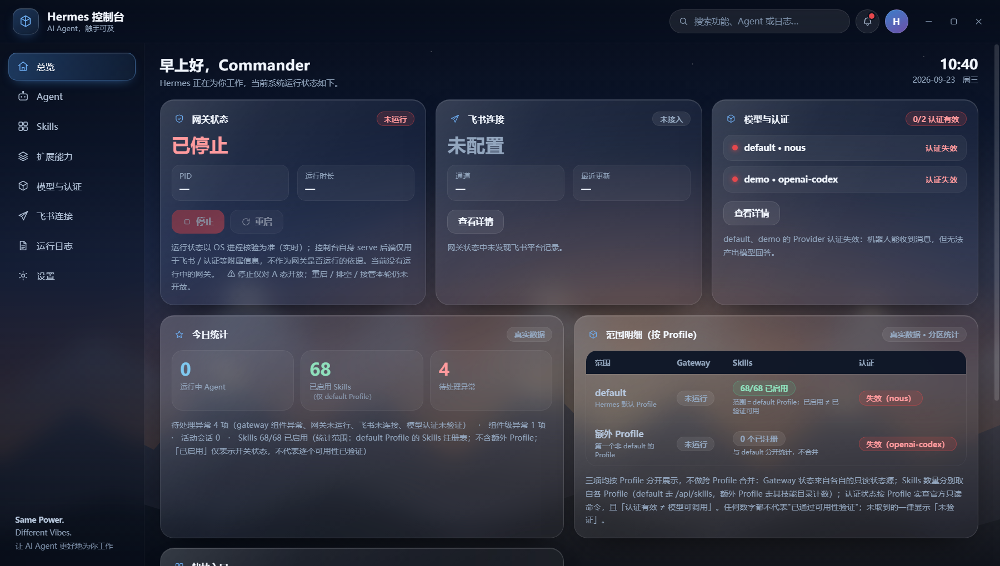
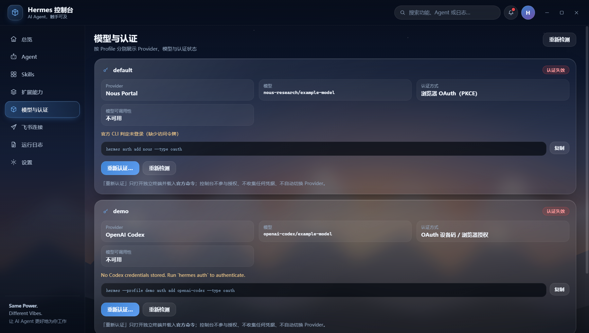
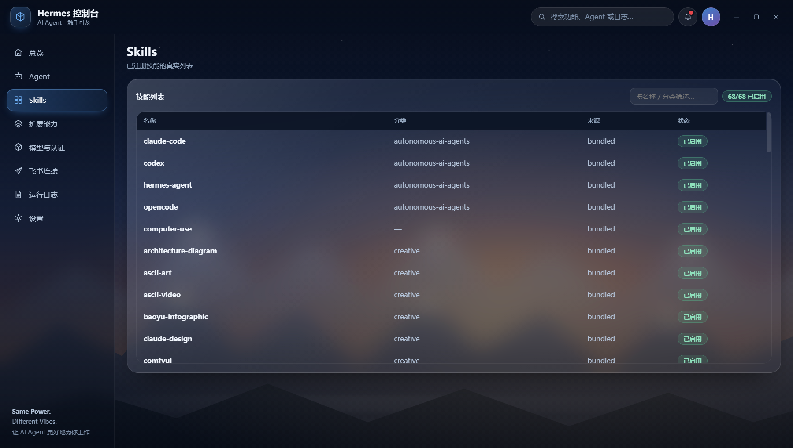
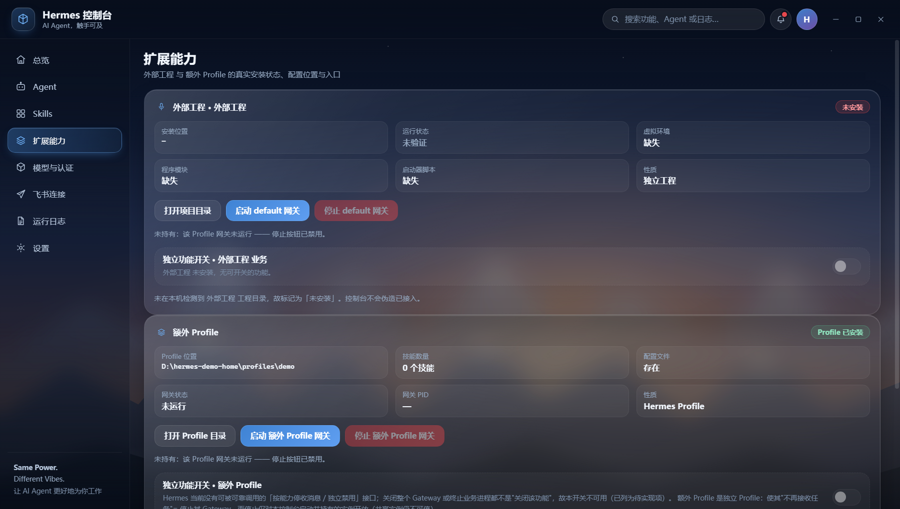
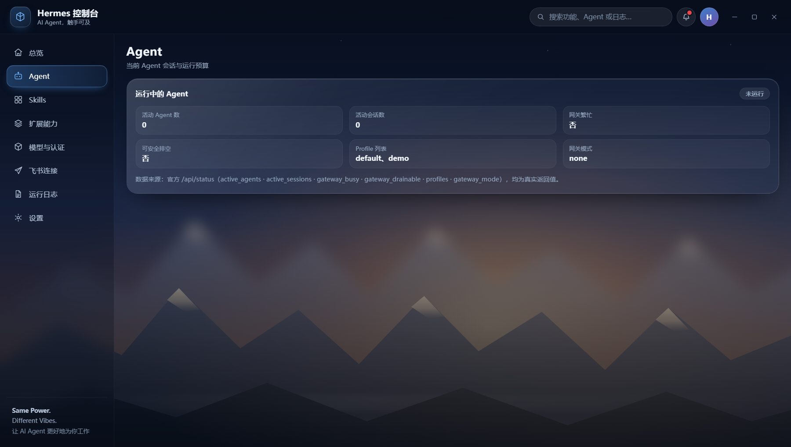
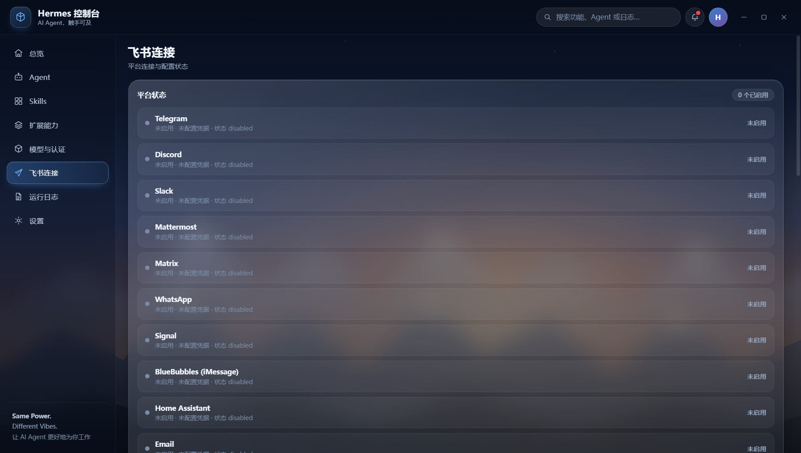
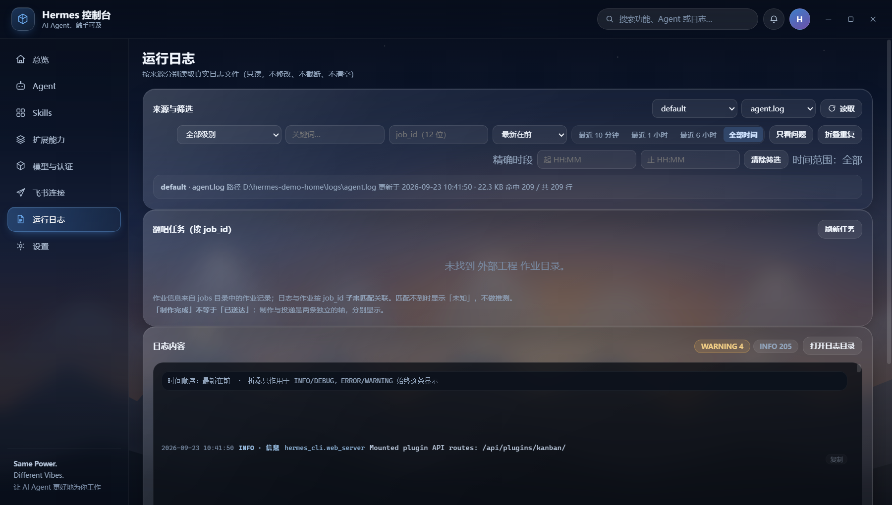
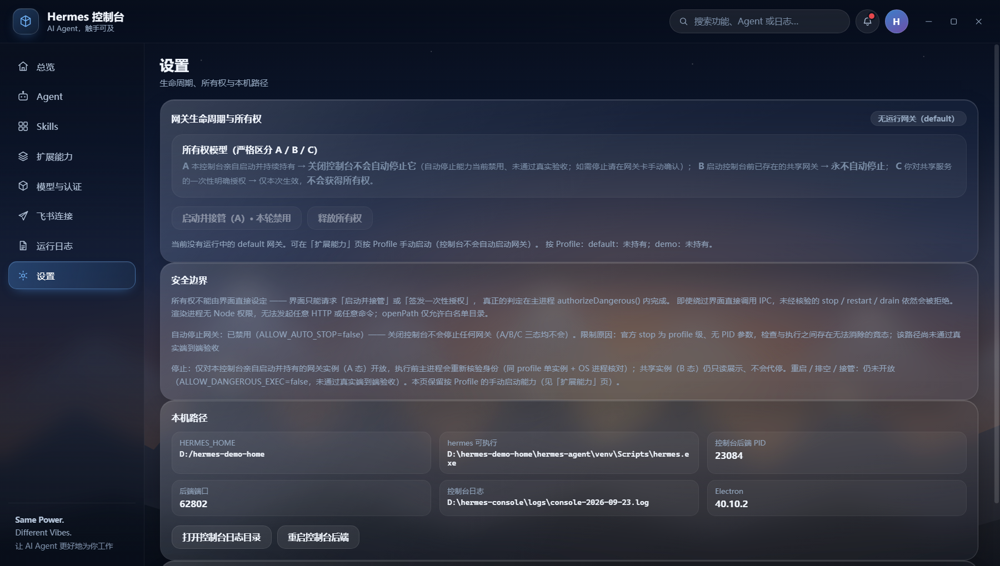

# Hermes Console

> A Windows-first desktop console for managing Hermes gateway, profiles, models, skills, plugins, sessions and integrations.

**This is an independent community project and is not an official Hermes application.**
It does not replace Hermes, does not bundle Hermes, and does not redistribute any Hermes source
code — it drives the `hermes` CLI you already have installed on your machine.

> ⚠️ **First public preview.**
> This release has **not** been validated with a clean-machine fresh-install acceptance run in an
> isolated environment. It has been exercised on the maintainer's own Windows machine only.
> No claim is made about cross-device compatibility or complete end-to-end verification.
> （首次公开预览版。尚未在独立干净环境中完成全新安装验收。）

---



---

## Highlights

Everything below is implemented in this build and visible in the screenshots.

| Area | What the console actually does |
| --- | --- |
| **Gateway lifecycle** | Start / stop a gateway **per profile**, with OS-level process verification (PID + process creation time + `HERMES_HOME` + single-instance check) before any stop is allowed |
| **Ownership model (A / B / C)** | Distinguishes gateways *this console started* (A) from *pre-existing shared* gateways (B) and one-shot explicit authorisation (C). Shared gateways are **never** auto-stopped |
| **Profiles** | Discovers `default` and any additional profile directories at runtime; per-profile gateway, skills and auth counters are shown separately and are never merged |
| **Models / Providers** | Reads `provider` and `model` from each profile's `config.yaml`; shows auth state per profile from the read-only official command `hermes auth status <provider>` |
| **Skills** | Lists the real skills registry reported by the Hermes backend API, with category, source and enabled state |
| **Extensions / plugins** | Read-only install status, location, virtual-env presence and process state for an optional external project and for extra profiles, plus a directory shortcut |
| **Agent** | Active agents, active sessions, gateway busy / drainable flags, profile list and gateway mode — straight from the official `/api/status` |
| **Integrations** | Platform connection status (Feishu / Lark, Telegram, Discord, Slack, WeCom, …) with explicit "not configured" states — never a guessed "connected" |
| **Logs** | Four separated sources (default profile, extra profile, optional external project, console itself), level filter, time window, folding of repeated INFO lines, and **automatic secret redaction** before display or copy |
| **Settings** | Shows the ownership model, the security boundaries, and the local paths in use |

Design rule followed throughout: **when a value cannot be verified, the UI shows "未验证" (unverified) — it never invents one.**

---

## Installation

### Requirements

* Windows 10/11, x64
* A **working local Hermes installation** (`hermes` CLI + gateway). The console is a control
  surface *for* Hermes; without Hermes installed it starts but most pages show "not found" /
  "未验证" instead of data.
* No Node.js required if you use the portable archive.

### Download and run (portable ZIP)

1. Download `hermes-console-0.1.0-portable-win-x64.zip` from the
   [Releases page](https://github.com/beyoda/hermes-console/releases).
2. Verify the checksum (see *Checksums* below).
3. Unzip to a folder of your choice, for example `C:\Tools\hermes-console\`.
4. Run `electron.exe` (or `hermes-console.exe` if your archive provides the renamed launcher).
5. The console detects your Hermes home automatically:
   * `%LOCALAPPDATA%\hermes` if it exists, otherwise
   * the path you pass in the `HERMES_HOME` environment variable.

### Pinning a specific Hermes home

```bat
set HERMES_HOME=D:\hermes
electron.exe
```

### Optional: external project panel

The **扩展能力 (Extensions)** page can also show the install state of one optional external
project directory. Point it at a folder with:

```bat
set HERMES_CONSOLE_EXTRA_DIR=D:\my-external-project
```

If the variable is unset or the directory does not exist, the panel reports "未安装 (not installed)"
— the console does not pretend it is present.

### First launch checklist

* Overview shows gateway state (running / stopped) — not "读取中".
* Model page shows a provider and model **only if** your `config.yaml` has them.
* Auth shows `valid` / `expired` / `unverified` — it is read from the official command, not guessed.
* If a page stays empty, see Troubleshooting below.

### Troubleshooting

| Symptom | Likely cause | What to do |
| --- | --- | --- |
| Console starts but everything says 未验证 / 未识别 | Hermes not found | Check `%LOCALAPPDATA%\hermes` exists, or set `HERMES_HOME` |
| Backend never becomes ready | `hermes serve` failed to start | Run `hermes serve --host 127.0.0.1 --port 0` in a terminal and read its stderr |
| Gateway start button does nothing | Another gateway instance for that profile already exists | Stop it from wherever it was started; the console refuses to own a second instance |
| Stop button is disabled while the gateway is running | The gateway is **not owned** by this console (state B), or ownership could not be confirmed | Start the gateway from this console if you want it to be stoppable here; shared instances must be stopped by whoever started them |
| Skills page is empty | Backend API did not answer | Confirm `hermes serve` is reachable; the console never fabricates skill counts |
| Nothing renders / white window | Electron runtime blocked by policy or GPU issue | Try launching with `--disable-gpu` |

### Developer setup

```bash
git clone https://github.com/beyoda/hermes-console.git
cd hermes-console
npm install electron --save-dev      # the app itself has zero npm runtime dependencies
npm start                            # runs: electron .
```

Run the test suite (no framework, pure Node test runner):

```bash
npm test     # node --test tests/*.test.js
```

---

## Architecture

```text
Hermes Console  (Electron main process, Node-free renderer)
|
+-- Hermes CLI / Gateway ....... started & verified through the official CLI + OS process check
+-- Profiles ................... discovered at runtime: default + HERMES_HOME/profiles/*
+-- Models / Providers ......... parsed from each profile's config.yaml
+-- Skills ..................... read from the Hermes backend API
+-- Plugins / Extensions ....... read-only install + process state, directory shortcuts
+-- Sessions / Agent ........... official /api/status (active agents, sessions, drainable)
+-- Logs ....................... 4 separated sources, folding + redaction, read-only IPC
+-- Integrations ............... platform connection status per integration
```

Main files:

| File | Role |
| --- | --- |
| `main.js` | Electron main process, IPC surface, ownership, gateway lifecycle |
| `ownership.js` | Pure logic: identity verification, authorisation gate, stop verdict |
| `process-probe.js` | Read-only OS process probe (Windows / POSIX), instance-chain merge |
| `auth.js` | Pure logic: official auth command construction + output parsing |
| `logsources.js` | Pure logic: multi-source log parsing, folding, secret redaction |
| `watchdog.js` | Supervises the console process for crash-side gateway decisions |
| `renderer/` | UI (no Node integration; talks to main only through `preload.js`) |
| `tests/` | 12 suites, 514 assertions (515 when an Electron process is already running — one real-condition check in `process-probe` only executes then), run with `node --test` |

---

## Security & privacy

* **The console never stores or transmits your API keys.** It does not read secret values out of
  your configuration beyond what the official read-only command reports, and it never writes
  credentials anywhere.
* **Secrets stay on your machine.** Authentication is performed by *you* in a separate terminal
  with the official command; the console only opens that terminal and pre-fills the command.
* **Logs and sessions may contain sensitive content.** The log viewer redacts credential-shaped
  strings (JWTs, `sk-` keys, `key=value` pairs, long opaque tokens) before rendering or copying,
  but redaction is shape-based and **not a guarantee**. Scrub before sharing anything publicly.
* **Dangerous operations are gated in the main process**, not in the UI. Disabling a button is not
  treated as a permission check; `authorizeDangerous()` re-verifies identity against live OS state
  before every stop.
* **No telemetry, no auto-update, no outbound network except the local Hermes backend.**

Please report security issues privately — see [SECURITY.md](SECURITY.md).

---

## Screenshots

All screenshots come from the real application, running against a **synthetic demo Hermes home**
(no real credentials, no real sessions, no personal paths).

| Overview | Models & auth |
| --- | --- |
|  |  |

| Skills | Extensions |
| --- | --- |
|  |  |

| Agent / sessions | Integrations |
| --- | --- |
|  |  |

| Logs | Settings |
| --- | --- |
|  |  |

---

## Known limitations

* **Windows only.** Linux/macOS is unexplored (see roadmap).
* **Fresh-install acceptance on a clean machine has not been performed** for this release.
* **No installer and no auto-update.** The v0.1.0 artifact is a portable ZIP.
* **Automatic gateway stop on console exit is disabled** (`ALLOW_AUTO_STOP=false`) because the
  official stop is profile-scoped with no PID argument, leaving an unavoidable check-to-execute
  race. Stopping is manual and only permitted for gateways this console started.
* Gateway **restart / drain / adopt** are hard-disabled (`ALLOW_DANGEROUS_EXEC=false`).
* Secret redaction in the log viewer is heuristic, not cryptographic.
* There is no CI pipeline yet; tests are run locally with `node --test`.

---

## Roadmap

See [ROADMAP.md](ROADMAP.md). Short version: v0.1.x focuses on installer, first-run diagnostics,
error UX and log filtering; v0.2 explores cross-platform feasibility and remote gateways.

## Contributing

See [CONTRIBUTING.md](CONTRIBUTING.md). Bug reports and small, well-scoped pull requests are
welcome. Please do not open issues containing real credentials, tokens, personal paths or
unredacted logs.

## License

[MIT](LICENSE) © 2026 beyoda. The portable bundle redistributes the Electron runtime (MIT);
this project is otherwise independent of, and unaffiliated with, Hermes.
